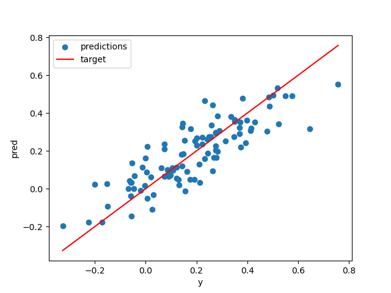

# Linear System Solver
Find `x,b` that minimize mean square error of the linear equation `Ax + b = y`

## Usage
```
usage: Linear system solver: solve Ax + b = y [-h] [--no-bias] [--delimiter DELIMITER] [--plot PLOT] [--pred PRED] [--dtype {float32,float64}] A y

positional arguments:
  A                     file for matrix A
  y                     file for vector y

options:
  -h, --help            show this help message and exit
  --no-bias             solve for Ax = y
  --delimiter DELIMITER
  --plot PLOT           file to save plot image
  --pred PRED           file to save predictions
  --dtype {float32,float64}
```

## Example
```
$ python
>>> import numpy as np
>>> A = np.random.rand(100, 3)
>>> x = np.asarray([0.2, -0.5, 0.3])
>>> b = 0.2
>>> y = A@x + b + np.random.randn(100)*0.1
>>> np.savetxt('A.csv', A)
>>> np.savetxt('y.csv', y)
>>> exit()

$ python solver.py --delimiter , A.csv y.csv --plot plot.png
x = [ 0.23424082 -0.46180019  0.31642222], b = 0.15877131834824743, err = 1.1285402164351046
```

